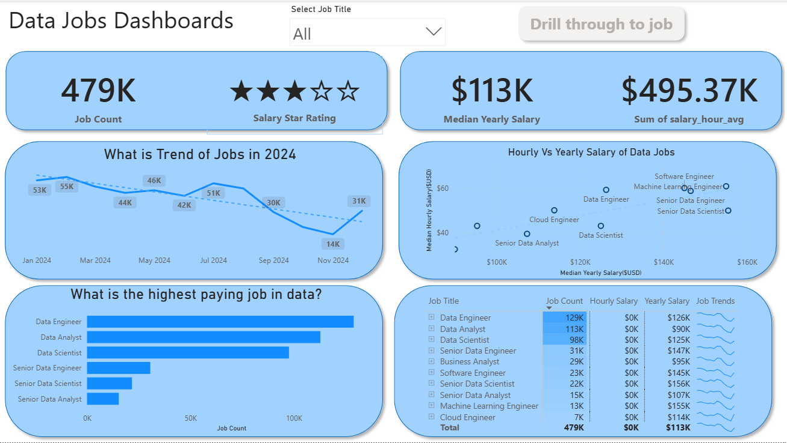

# My Power BI Dashboard Portfolio 📊

Data Nerds! This repository is a collection of Power BI dashboard I've developed. It tracks my journey in using Power BI, from foundational reports to more advanced interactive analyses, all aimed at turning data into clear, actionable insights.

# Featured Dashboard 

Explore the dashboard below. Each has its own dedicated README with more details on the build process and specific features.

## 📉 Data Jobs Dashboard (V1 - Comprehensive Exploration)

**Key Power BI Skills Utilized:**
* 🎨 Dashboard Layout & Design
* ⚙️ Power Query (ETL & Data Shaping)
* 🔗 Basic Data Modeling (Table Relationships)
* 🧮 Implicit Measures & Standard Aggregations
* 📊 Core Charts (Bar, Line, Area, Column)
* 🗺️ Map Visualizations for Geospatical Data
* 🔢 KPI Cards & Detailed Data Tables
* 🖱️ Interactive Slicers for Filtering
* 🔘 Buttons & Bookmarks for Page Navigation
* ➡️ Drill-Through Functionality

[🔗 **View Full Project 1 Details (README)**](/Data_Jobs_V1/README.md)

